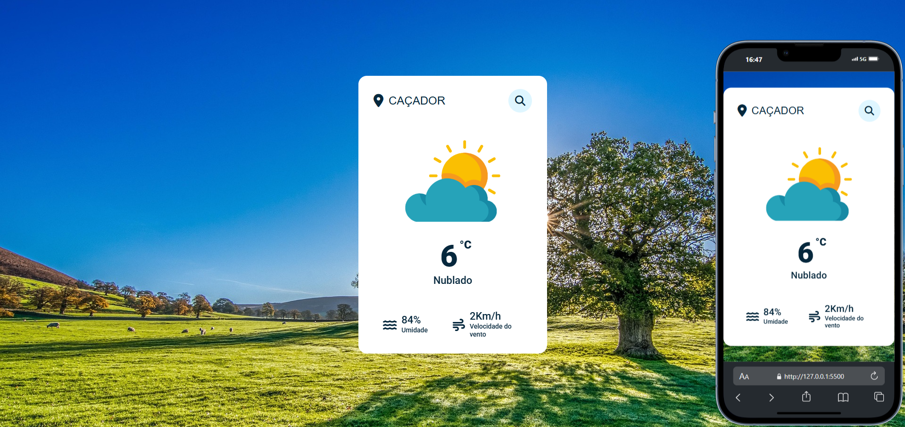

## Weather App

Projeto de página de previsão de Tempo em JavaScript. Esse projeto foi desenvolvido em HTML5, CSS3, JavaScript e utiliza a API do Open Weather Map.

***
Para rodar a aplicação, é necessário possui a chave de API, e incluí-la na seguinte linha:

```bash
  const APIKey = 'SUA API';
  ````

***
## Screenshots:

***


